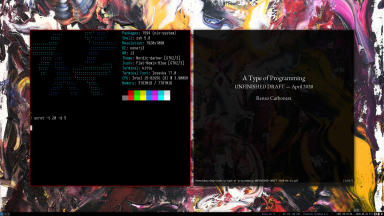

# NixOS-zoo

This repo is a work in process, containing configuration files for my
personal machine with NixOS unstable on encrypted zfs. But more, it will also contain
educational NixOS/Nix* ecosystem recipes, documented workflows and notes in
form of learning snippets. Hopefully this will evolve into *packaging*
nixpkgs tutorials,interacting with Hydra/NixOps and playing
with *nix* expression language.


## Contents

* [Preview](#preview)
* [TODO](#todo)
* [Default applications](#default-applications)
* [NixOS workflows](#nixos-workflows)
  * [Syncronizing NixOS With Git](#syncronizing-nixos-with-git)
  * [Documentation request fhs](#documentation-request-fhs)

### Default applications:

- **OS**:            NixOS unstable
- **WM**:            i3-gaps with i3Blocks status line
- **Terminal**:      Kitty
- **Shell**:         Zsh
- **File explorer**: Ranger
- **Launcher**:      Rofi
- **Editor**:        Kanouke/Emacs
- **Browser**:       Qutebrowser
- **PDF viewer**:    Zathura


### Preview



### TODO

- [ ] setup jack with Haskell Tidal
- [ ] nixpkgs!
- [ ] home-manager workflows

### NixOS workflows

* Syncronizing NixOS With Git
  * [can I move /etc/nixos to my dotfiles and symlink it back to
/etc/nixos/?](https://discourse.nixos.org/t/can-i-move-etc-nixos-to-my-dotfiles-and-symlink-it-back-to-etc-nixos/4833/13)

> There's no need to symlink - `/etc/nixos/configuration.nix` is just the
default location, and you can change it. When you run nixos-rebuild, it looks up
the value of "nixos-config" in the NIX_PATH environment variable, so you can
point that wherever you want. Example (as root):

```
export NIX_PATH="nixos-config=/path/to/configuration.nix"
nixos-rebuild switch
```

Note: you could fetch your coniguration while still in  the installer and
install it all at once.

> Year your user can own `/etc/nixos/`. Rather than symlink or setup the
NIX_PATH, I just keep /etc/nixos directly as a git repo owned by my user. When
you boot up on the very first install, you can install git with nix-env, clone
the repo as root, build the OS, and then at a later point chown /etc/nixos to
yourself once your user exists.

* Initializing a git repo:

```
# create a repository (example: nixos-zoo) on github.com without a README

cd dotfiles
echo "# nixos-zoo" >> README.md
git init
git add README.md
git commit -m "first commit"
git remote add origin https://github.com/username/nixos-zoo.git
```

* Documentation request: FHS(#documentation-request-fhs)

Nix needs documentation for it's peculiar *FHS conventions*.
For example: the layout of `/run/current-system` or `/run/current-system/sw`,
how it relates to `XDG_DATA_DIRS`, etc. So also information explaining NixOS's
default `XDG` setting conventions? It might be good to also have *crosslinks* to
relevant module options.

Labels: 0.kind: bug, 6.topic: nixos, 9.needs: documentation

As always I first go to ArchWiki since I find the request a bit vague, need to
explore **FHS Conventions** in *general*.

> Arch Linux follows the *file system hierarchy* for operating systems using the
**systemd** service manager. See
[file-hierarchy](https://jlk.fjfi.cvut.cz/arch/manpages/man/file-hierarchy.7)
for an explanation of each directory along with their designations. In
particular, `/bin`, `/sbin`, and `/usr/sbin` are symbolic links to `/usr/bin`,
and `/lib` and `/lib64` are symbolic links to `/usr/lib`.

Note: But following the file-hierarchy link on `/run/` I read:

**RUNTIME DATA**

- `/run/` -> A "tmpfs" file system for system packages to place runtime data in. This
directory is flushed on boot, and generally writable for privileged programs
only. Always writeable.

- `/run/log/` -> Runtime system logs. System components may place private logs in
this directory. ALways writable, even when `/var/log/` might not be accessible
yet.

- `/run/user/` -> Contains per-user directories, each usually individually
mounted "tmpfs" instances. Always writable, flushed at each reboot and when the
user logs out. User code should not reference this directory directly, but via
the `$XDG_RUNTIME_DIR` environment variable, as documented in the **XDG Base
Directory Specification**.

```
> ls /run

agetty.reload   dhcpcd.sock          log             systemd     xtables.lock
binfmt          dhcpcd.unipriv.sock  mount           tmpfiles.z  zed.pid
blkid           initctl              NetworkManager  udev        zed.state
booted-system   keys                 nixos           udisks2
current-system  lightdm              nscd            user
dbus            lightdm.pid          opengl-driver   utmp
dhcpcd.pid      lock                 resolvconf      wrappers
```

Note: Now I am using `ranger` to explore the hierarchy since cd-ing and
i-ing into each directory is tedious. CLI file explorers such as ranger really
shine, I can see the whole structure and go back and forth. Ranger has nice
previews too so it can preview an image or a text file which greatly saves time.

I strolled around the root directory for a while observing various files but
then I begin to google term "nixos" and "fhs" and I see [Faking Non-NixOS for
Stack](https://vaibhavsagar.com/blog/2018/03/17/faking-non-nixos-stack/)
blogpost by Vaibhav Sagar. Vaibhav begins:
> I like most things about NixOS, but one thing I do not like is the way it
integrates with `stack`. Nix's own Haskell infrastructure works well enough that
this is not an issue for my own projects, but sometimes I want to test that the
Stack workflow is fine for people using less opinionated distros like Ubuntu.
Fortunately, **Nixpkgs includes a handy tool called** `buildFHSUserEnv` **which
will build a chroot wherein everything is laid out according to the [Filesystem
Hierarchy Standard](https://en.wikipedia.org/wiki/Filesystem_Hierarchy_Standard)
that most software is accustomed to. This means we can provide an environment
with Stack and any dependencies and it will happily run.

* [ ] - read the blog post and build the **IHaskell** notebook!

Reading the wiki on FHS NixOS is mentioned too:
> Most Linux distributions follow the Filesystem Hierarchy Standard and declare
it their own policy to maintain FHS compliance. **GoboLinus** and **NixOS**
provide examples of intentionally non-compliant filesystem implementations. *But
it also says that:* The FHS is a 'trailing standard', and so documents common
practices at a point in time. Times of course change, and distribution goals and
needs call for experimentation. *And we come to our /run/ being mentioned too:*

Modern Linux distributions include a `/run` directory as a temporary filesystem
(tmpfs) which stores volatile runtime data, following the FHS version 3.0.
According to the FHS version 2.3, such data were stored in `/var/run` but this
was a problem in some cases because this directory is not always available at
early boot. As a result, these programs have had to resors to trickery, such as
using `/dev/.udev`..

Note: So it is rather flexible, distros are changing the overlay of the system,
and now I see some NixOS rants on how FHS is broken a bit with a smile since
they themselves are helping us be aware of that *brokeness* and by their work
and the work of others the FHS is actually changing, it just seems it takes a
long time for these changes to take action. I see Debian has moved a lot of
directories to `/run` in 2013.

Now I google more and find an interesting StackExchange answer [nixos
executable on NixOS](https://unix.stackexchange.com/questions/522822/different-methods-to-run-a-non-nixos-executable-on-nixos)
The user has explained several methods of running a script on nixos, the cool
part is that it is explained in three methods, the full manual, the patched
version and methods based on FHS plus some other advices. The user has included
a simple derivation as well and since I also would like learn nixpkgs packaging
this answer has lots of educational points! I am happy that by just exploring
seeminlgy boring issue such as FHS documentation I learned how to build IHaskell
notebooks with stack on NixOS and and also read about a process of packaging a
nix package from the essential manual method to a full derivation expression.

* [ ] - read the answer and study the packaging examples

The method 5 was to use FHS to simulate a classic linux shell, and manually
execute the files which is the same method used by Vaibhav in building IHaskell
on NixOS. User adds
> Some software may be hard to package that way because they may havily rely on
FHS file tree structure, or may check that the binary are unchanged. You can
then also use `buildFHSUserEnv` to provide an FHS file structure (lightweight,
using namespaces) for your application. **Note that this method is heavier that
the patch-based methods, and add significant startup time, so avoid it when
possible**

Our FHS NixOS adventure continues by reading this interesting post in NixOS
discourse on [Using Julia with
NixOS](https://discourse.julialang.org/t/using-julia-with-nixos/35129)
where again a nix *derivation* is described which *pulls* all the dependency libs and
sets up.
The user again mentions FHS issues with NixOS:
> To give an example of what it implies in the case of python, a typical
installation with `pip` or `conda` of a python package might not work, since it
is usually looking for files on specific dierctories (on a prescribed FHS like
`/usr/lib`, `/usr/share/` or similar) to serolve dependencies. Actually, it
happens that these dependencies are (or can be) in the system but not there
(when conda/pip are looking for them).

But the nice part is that the solution is simple when you look at the derivation
and the seemingly difficult problem is solved in an elegant nix way, again by
using just nix expression language.
