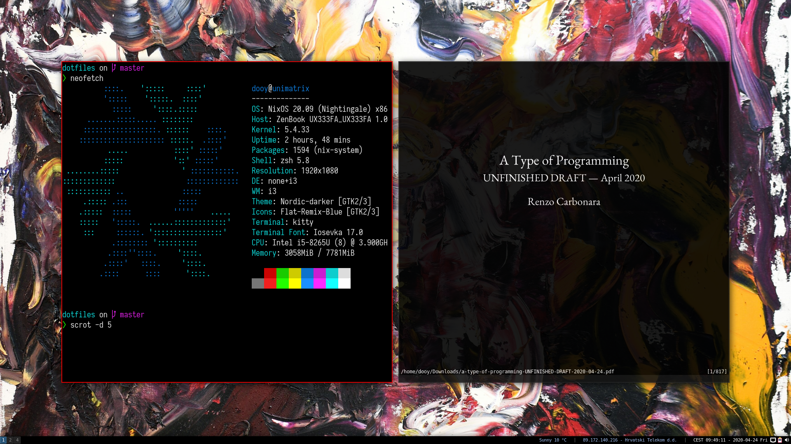

# nixos-zoo

This repo contains configuration files for my personal machine with NixOS on encrypted zfs and NixOS/Nix* ecosystem recipes.

## Contents

* [Preview](#preview)
* [Quick-start](#quick-start)
* [Default applications](#default-applications)
* [NixOS recipes](#nixos-recipes)

Personal setup:

- **OS**:        NixOS
- **WM**:        i3-gaps
- **Terminal**:  kitty
- **Launcher**:  rofi
- **Editor**:    kanouke
- **Browser**:   qutebrowser

## Preview

